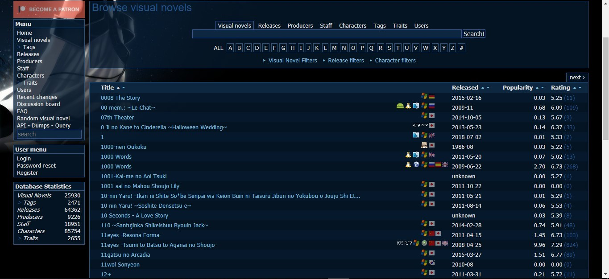
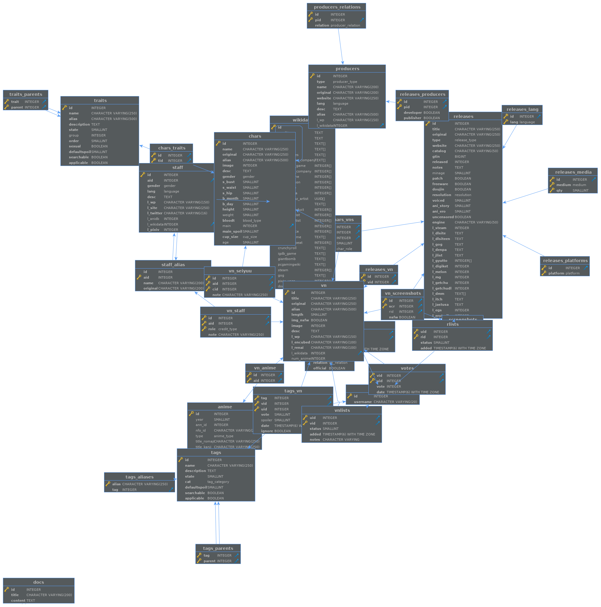
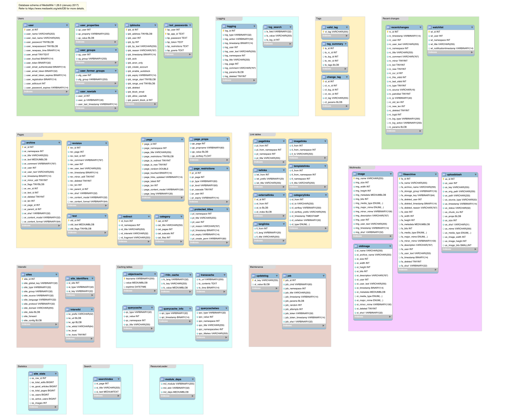

# TABD

Database Optimization

By a group of weebs ([@dreamski21](https://github.com/dreamski21), [@WanisRamdani](https://github.com/wanisramdani), [@YounesDjakour](https://github.com/younesdjakour), and [@OussamaChebbah](https://github.com/oussamachebbah))

---

## Whats and Whys

---

### What and Why This Content?


Note:
- A visual novel is a genre of video games, where you mainly interact with text and static images.
- We all are familiar with this type of content and it's more interesting

---

### What and Why This Website / Database?



Note:
- "VNDB.org strives to be a comprehensive database for information about visual novels."
- VNDB releases their database backup monthly or bi-monthly
- The website is *open source,* it's an *open database,* and it contains *open content*
- Big enough to see results of our optimizations

---

Ace Attorney for example...


---

Ace Attorney on VNDB


Note:
- as you can see; main info (title, desc, image) in addition to relations/sections like anime and releases

---

It's huge, man...



Note:
- Lotta rows and relations, to see the result of optimization and its effects on joining

---

Kidding. We'll just focus on a few tables~


---

### What and Why This 'SGBD'?


Note:
* It's open source, multi-platform
* It supports stuff we will be learning:
  - Indexation (the *btree* method specifically)
  - Partitioning
  - Triggers
  - Views
  - Materialized views
* It has some useful features we will be using (we will get to them in a jiffy)
* But, to be honest, it just was the easiest to import the database to.

---

## Preparations

---

### Installing and Importing

```
# After downloading VNDB's database dumps (https://vndb.org/d14)

# Install Postgres
sudo apt install postgresql-11

# Extract the tar.zst archive (see stackoverflow.com/a/45704163/)
dreamski@despair:~$ sudo apt install zstd
dreamski@despair:~$ mkdir vndb-extracted && cd vndb-extracted
dreamski@despair:~$ tar -I zstd -xvf ../vndb-db-2019-11-26.tar.zst

# Open Postgres, create a new database, and connect to it
dreamski@despair:~$ sudo -u postgres psql
CREATE DATABASE vndb
\c vndb

# Start importing
\cd /home/dreamski/vndb-extracted/
SET client_encoding TO 'UTF8';
\i import.sql
```

---

### Config
We disable all optimizations we don't care about... for now.

```sql
set enable_seqscan = on;

set enable_indexscan = off;
set enable_indexonlyscan = off;
set enable_partition_pruning = off;
set enable_partitionwise_join = off;
set enable_partitionwise_aggregate = off;
set enable_material = off;
set constraint_exclusion = off;

set enable_mergejoin = off;
set enable_bitmapscan = off;
set enable_gathermerge = off;
set enable_hashagg = off;
set enable_hashjoin = off;
set enable_nestloop = off;
set enable_parallel_append = off;
set enable_parallel_hash = off;
set enable_sort = off;
set enable_tidscan = off;
```

Note:
- The imported database is already optimized, this is we disable optimizations

* See:
  - www.postgresql.org/docs/11/runtime-config-query.html

---

We will be using `EXPLAIN ANALYZE <whatever>` to see actual execution times and what plan was used.

**(Remember l'cours? :3)**

Note:
- See www.postgresql.org/docs/11/using-explain.html

---

### Tables

These are the normalized tables we will be using...

```sql
/* `\d` is the same as MySQL's `DESCRIBE` command */
\d vn
\d anime
\d vn_anime
```

---


Note:
- *Draw attention to specific columns*

---

## Indexation

---

How our database is used...

```sql
SELECT title FROM vn WHERE title = 'Joker';

-- What type of anime does the 'Akira' vn have?
SELECT v.title, a.type FROM anime a, vn v, vn_anime va
  WHERE v.id = va.id AND a.id = va.aid AND v.title = 'Akira';
```

Note:
...

---

```sql
-- First, we re-enable the indexation feature
set enable_indexscan = on;
set enable_indexonlyscan = on;
```

```sql
-- Then, we create an index
CREATE INDEX title_idx ON vn USING btree (title);
```

Note:
- The 'USING method' part is optional.
  If not specified, the SGBD uses its default method, which is probably *btree* as it's the most efficient.
- Why choose the `title` column? Because that's what most of our query use in the `WHERE` clause;
  Users (and thus queries) often use titles to select (or search for) records...

---

Let's test again...

```sql
SELECT title FROM vn WHERE title = 'Joker';

-- What type of anime does the 'Akira' vn have?
SELECT v.title, a.type FROM anime a, vn v, vn_anime va
  WHERE v.id = va.id AND a.id = va.aid AND v.title = 'Akira';
```

---

```sql
-- To delete the index
DROP INDEX title_idx;
```

Note:
- An index is basically a table and can be treated similar to it by altering it, dropping it, etc.

---

### Pros

Note:
- Speeds up stuff~

---

### Cons

Note:
- Taking extra space
- Performance penalty when updating
- May harm performance if done poorly
- Indexation keys should be unique and don't change often
- *Maybe talk about partial indexes*
- *Mention the extreme example of sqlite especially with partial indexes?*
- TODO: Maybe add the extreme example of indexation in sqlite

---

## Denormalization

Note:

Denormalization is the process of reintroducing data redundancy; it is an optimization technique used to speed up queries execution.

### Why
The first step of database design is creating a normalized schema of the relations.
However, the process of normalization only cares about grouping information in non-redundant relations, but it does not take performance into account.

Also consider that we are working with a relational database (based on relational algebra) where new information is reduced/derived from the existing relations using joins, which is very expansive in computation time and resources...

Denormalization _may_ be used to re-introduce redundancy to improve the database's performance by providing alternatives to common join operations.

---

### Before you denormalize, normalize and analyze

Note:

Before we decide to denormalize our database we must:

- Test the performance of our normalized database in a real (or realistic) environment

- Get a good understanding of how our database is used and its data characteristics

- Learn what operations are frequently used (e.g. reading or updating)

- Ensure that the cost of denormalization vs the average execution time of denormalized queries must be less than performing joins on normalized tables.)

---

### Adding redundant columns

In this method, only the redundant column which is frequently used in the joins
is added to the main table. The other table stays as it is.

---

### Adding precomputed columns

Suppose that our analysis of the database and updated requirements showed that such operations occur a lot:

```sql
-- How many anime does the 'Akira' visual novel have?
SELECT count(a.id) FROM anime a, vn v, vn_anime va
  WHERE v.id = va.id AND va.aid = a.id AND v.title = 'Akira';
```

---

So we have opted to add a new column for the precomputed count of animes each vn has,
because our that's the most important (and costly) operation our application will be doing...

```sql
ALTER TABLE vn ADD num_anime int default 0;

-- Let's populate num_anime ('dvn' stands for 'denormalized vn')
UPDATE vn dvn SET num_anime = (
  SELECT count(a.id) FROM anime a, vn v, vn_anime va
    WHERE v.id = dvn.id AND v.id = va.id AND va.aid = a.id
);
```

```sql
-- To normalize 'vn' again, we can simply delete the redundant column
ALTER TABLE vn DROP IF EXISTS num_anime;
```

---

Testing with and without the newly added column

```sql
-- Testing with 'Fate/Stay Night' vn whose id is 11 (https://vndb.org/v11)
EXPLAIN ANALYZE  
SELECT v.title, count(a.id) FROM anime a, vn v, vn_anime va
  WHERE v.id = va.id AND va.aid = a.id AND v.id = 11
  GROUP BY v.title;
```

```sql
EXPLAIN ANALYZE  
SELECT v.title, v.num_anime FROM vn v WHERE v.id = 11;
```

---

### Creating new redundant tables

Note:

Creating new tables that contain completely redundant information.

It is normally used for data analysis and statistics, it does not need to be consistent with the rest of the database at all times...
Can be updated with cron jobs (`*/30 * * * * psql vndb -c "DROP table ..; CREATE table ..; INSERT ..;"`) or watched expressions (e.g. `\watch 180` re-executes the previous statement every 3 minutes)

---

```sql
EXPLAIN ANALYZE
select v.title, p.name
from vn v, releases_vn rv, releases r, releases_producers rp, producers p
where v.id = rv.vid and rv.id = r.id and r.id = rp.pid and p.id = rp.id and
rp.developer = true and v.id = 11;

-- Time: 1718.664 ms (00:01.719)
```

---

```sql
CREATE TABLE d_vn_developers (
  vid int,
  rid int,
  did int,
  dname varchar(200) not null,

  foreign key (vid) references vn(id),
  foreign key (rid) references releases(id),
  foreign key (did) references producers(id)
);
```

```sql
insert into d_vn_developers(vid, rid, did, dname)
select v.id, r.id, p.id, p.name
from vn v, releases_vn rv, releases r, releases_producers rp, producers p
where v.id = rv.vid and rv.id = r.id and r.id = rp.pid and p.id = rp.id and rp.developer = true;

-- Time: 428195.763 ms (07:08.196)
```

---

```sql
EXPLAIN ANALYZE
select dname
from d_vn_developers
where vid = 11;

-- Time: 4.913 ms
```

```sql
EXPLAIN ANALYZE
select v.title, d.dname
from vn v, d_vn_developers d
where v.id = d.vid and v.id = 11;

-- Time: 100.660 ms
```

---

### Combining tables

For example:
- `COMIC(id, authorId, artistId, title, price, releaseDate)`
- `PERSON(id, type, name, pseudonym)`

Becomes `COMIC(id, authorName, artistName, authorPseudonym, artistPseudonym, price, title, releaseDate)`

---

### Pros

- Retrieving data is faster since we do fewer-to-no joins.

- Depending on the denormalization method, the number of foreign keys and indexes get reduced. This helps lessen data manipulation time.

---

### Cons

- Speeds reading but at the cost of creating additional overhead for updating: You end up updating the same information in different places to ensure data consistency.

- Occupies extra space for the redundant information.

Also, failure to update the database "manually", makes it incoherent! But this can be fixed...

---

### Imagine...

What if we could automate updating denormalized columns or tables

Think, events that affect rows and statements (before, after, instead of specific operations)

These are called **triggers**...

---

## Triggers

Note:
- POINT OUT: We don't care about updates, only insert and delete events interest us; that's why we attach triggers on them.
- MENTION: Triggers are very important that's why we will be explaining them in some detail

---

```sql
CREATE FUNCTION inc_num_anime() RETURNS trigger AS
  '
  BEGIN
    /* vn.num_anime++ */
    UPDATE vn SET num_anime = (select v.num_anime + 1 from vn v where v.id = NEW.id);
    RETURN NULL;
  END;
  '
  LANGUAGE 'plpgsql';

CREATE TRIGGER anime_addition
  AFTER INSERT ON vn_anime
  FOR EACH ROW
  EXECUTE FUNCTION inc_num_anime();
```

---

```sql
CREATE FUNCTION dec_num_anime() RETURNS trigger AS
  '
  BEGIN
    /* vn.num_anime-- */
    UPDATE vn SET num_anime = (select v.num_anime - 1 from vn v where v.id = OLD.id);
    RETURN NULL;
  END;
  '
  LANGUAGE 'plpgsql';

CREATE TRIGGER anime_deletion
  AFTER DELETE ON vn_anime
  FOR EACH ROW
  EXECUTE FUNCTION dec_num_anime();
```

Note:

See:
- IBM's Knowledgebase on [Denormalization](ibm.com/support/knowledgecenter/SSEPEK_11.0.0/admin/src/tpc/db2z_denormalization.html)

- https://www.postgresql.org/docs/11/trigger-definition.html

- https://www.postgresql.org/docs/11/sql-createtrigger.html

- https://www.postgresql.org/docs/11/sql-createfunction.html

> "The return value of a row-level trigger fired AFTER or a statement-level trigger fired BEFORE or AFTER is always ignored; it might as well be null. However, any of these types of triggers might still abort the entire operation by raising an error."
-- https://www.postgresql.org/docs/11/plpgsql-trigger.html

> Row-level BEFORE triggers fire immediately before a particular row is operated on,
while row-level AFTER triggers fire at the end of the statement (but before any statement-level
AFTER triggers).
-- https://www.postgresql.org/docs/11/trigger-definition.html


---

Still, we ca do better...

---

## Partitioning

Note:

See:
- https://www.postgresql.org/docs/11/ddl-partitioning.html
- **CREATE TABLE** PARTITION BY, PARTITION OF, INHERITS, LIKE https://www.postgresql.org/docs/11/sql-createtable.html

---

### Horiz.

Note:
* TODO: Maybe partition 'vn' (by length - range) or of 'anime' by (by year - range?) or of anime by type (list)

* Plan
  - Part 1:
    1. Show manual partitioning using CREATE TABLE 'Y' like 'X' and adding CHECKs
    2. Use simple queries with `UNION ALL`
    3. `set constraint_exclusion = partition;`
      Mention that with a view and union all, it's better to set it as `partition` and not `on` do this because.
    4. Test again.
    5. Retry with a view. "Because we will be doing that a lot, let's make things easier and create a view"
    7. Test again. Better, huh?

  - Part 2:
    - `CREATE TRIGGER INSTEAD OF UPDATE ON anime_view ...`
    - Inserting to parent table, we use triggers to redirect inserts to appropriate partitions
    - Updates and deletions from parent table, can be done but we won't be addressing them because they're too complicated and we shouldn't be dealing with them in the first place: Partition your tables with stable columns (like dates, for historical data)

  - Part 3:  
    Since we are trying to abstract as used to do in 'POO', we could use inheritence to implement partitioning but this is bad for several reasons.
    Check caveats on the 'ddl-inherit' page.

  - Part 4:  
    But actually, Postgres has a built-in support for partitioning:
    1. Explain syntax
    2. Explain benefits (automates everything and removes most of the )

* See:
  - https://www.postgresql.org/docs/11/queries-union.html
  - https://www.postgresql.org/docs/11/ddl-inherit.html

---

### Verti.

Let's take the example of MediaWiki (as in, Wikipedia)



Note:
- To have smaller row sizes
- Maybe use EXPLAIN ANALYZE to show that row sizes (and costs) go down!

---

### Pros

Note:
- We can drop full partitions with a single action.

See:
- Microsoft docs - [Horizontal, vertical, and functional data partitioning](https://docs.microsoft.com/en-us/azure/architecture/best-practices/data-partitioning)

- Microsoft docs - [Partitioned Tables and Indexes](https://docs.microsoft.com/en-us/sql/relational-databases/partitions/partitioned-tables-and-indexes?view=sql-server-ver15)

- Oracles docs - [Partitioning Concepts](https://docs.oracle.com/cd/B28359_01/server.111/b32024/partition.htm)

- Parallel Plans https://www.postgresql.org/docs/11/parallel-plans.html

- JOIN, NATURAL JOIN: https://www.postgresql.org/docs/11/queries-table-expressions.html#QUERIES-FROM

---

### Cons

It exposes implementation details.. but this can be fixed...

---

## Vues

Think, ***abstract interfaces*** but for tables

Note:
- TODO: Already mentioned in **## Partitioning**, move or reword it, although it fixes/follows Paritioning's cons
- https://www.postgresql.org/docs/11/sql-createview.html

---

But even better... Let's go *materialistic* >.<

---

### Materialized Views

Think, ***caching***...

Note:

* Plan:
  1. Talk about creating a table THEN inserting into it
  2. Talk about creating a table AND inserting into it at the same time
  3. Say that a materialized view is basically a 2. that remembers it's init query and can be simply refreshed

* Mention: Not all SGBDs support it. For example, MySQL doesn't support them natively \[TODO: fact check this\].

See:
- https://www.postgresql.org/docs/11/sql-createtableas.html
- https://www.postgresql.org/docs/11/sql-creatematerializedview.html
- https://www.postgresql.org/docs/11/sql-refreshmaterializedview.html
- Materialized View (Postgres): https://stackoverflow.com/questions/29437650/how-can-i-ensure-that-a-materialized-view-is-always-up-to-date

---

## Clustering

...

---

## Credits
Credits, Disclaimer & Programs Used

- [VNDB.org](https://vndb.org) and its contributors

- [reveal-md](https://github.com/webpro/reveal-md)

- [DbVisualizer](https://www.dbvis.com/)

- _**Disclaimer: Screen captures of Danganronpa and Ace Attorney are used for educational and illustrative purposes under fair-use**_
